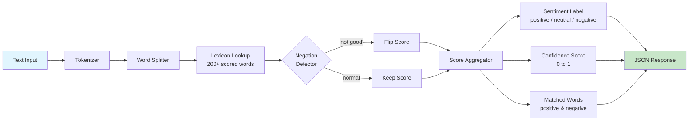

# Sentiment Analysis API

[](https://opensource.org/licenses/ISC)
[](https://apify.com/george.the.developer/sentiment-analysis-api)
[](https://nodejs.org)
[](https://apify.com/george.the.developer/sentiment-analysis-api)
[](https://apify.com/george.the.developer/sentiment-analysis-api)

Analyze text sentiment instantly. Returns positive, negative, or neutral with a confidence score. No external AI costs. Runs entirely on a built in word lexicon. Every request costs fractions of a cent.

## How It Works



## What You Get

- **Sentiment label**: positive, negative, or neutral
- **Score**: from negative 1 (very negative) to positive 1 (very positive)
- **Confidence score**: 0 to 1, how certain the analysis is
- **Matched words**: list of positive and negative words found in the text
- **Negation handling**: "not good" correctly scores as negative

## Why Zero LLM Cost Matters

| Approach | Cost per 1,000 texts | Speed | Privacy |
|----------|---------------------|-------|---------|
| GPT 4 | $30+ | 2 to 5 seconds each | Data sent to OpenAI |
| Claude | $15+ | 1 to 3 seconds each | Data sent to Anthropic |
| Google NLP API | $1+ | 500ms each | Data sent to Google |
| **This API** | **$3.00** | **Instant** | **No data leaves Apify** |

No LLM tokens. No external API calls. Pure algorithmic analysis using a lexicon of 200+ sentiment scored words based on the AFINN word list (public domain). Each word has a score from negative 5 (strongly negative) to positive 5 (strongly positive).

## Quick Start (cURL)

### GET request (short text)

```bash
curl "https://george-the-developer--sentiment-analysis-api.apify.actor/analyze?text=I%20love%20this%20product%20it%20is%20amazing"
```

### POST request (longer text)

```bash
curl -X POST "https://george-the-developer--sentiment-analysis-api.apify.actor/analyze" \
  -H "Content-Type: application/json" \
  -d '{"text": "The customer service was terrible and nobody helped me resolve the issue"}'
```

### Health check

```bash
curl "https://george-the-developer--sentiment-analysis-api.apify.actor/health"
```

## API Endpoints

This actor runs in **Standby Mode** for instant responses. No cold start, no queue wait.

### `GET /analyze?text={text}`

For short texts. URL encode the text parameter.

### `POST /analyze`

For longer texts. Send JSON body with a `text` field.

### `GET /health`

Returns service health status.

## Response Example

### Positive text

```json
{
  "text": "I love this product it is amazing",
  "sentiment": "positive",
  "score": 0.7,
  "confidence": 0.85,
  "details": {
    "wordCount": 8,
    "matchedWords": 2,
    "positiveWords": ["love", "amazing"],
    "negativeWords": [],
    "totalScore": 7,
    "averageScore": 3.5
  },
  "analyzedAt": "2026-04-12T15:00:00Z"
}
```

### Negative text

```json
{
  "text": "The customer service was terrible and nobody helped me",
  "sentiment": "negative",
  "score": -0.6,
  "confidence": 0.78,
  "details": {
    "wordCount": 9,
    "matchedWords": 2,
    "positiveWords": [],
    "negativeWords": ["terrible", "nobody"],
    "totalScore": -6,
    "averageScore": -3.0
  },
  "analyzedAt": "2026-04-12T15:00:01Z"
}
```

### Negation example

```json
{
  "text": "This product is not good",
  "sentiment": "negative",
  "score": -0.3,
  "confidence": 0.72,
  "details": {
    "wordCount": 5,
    "matchedWords": 1,
    "positiveWords": [],
    "negativeWords": ["not good"],
    "totalScore": -3,
    "averageScore": -3.0
  },
  "analyzedAt": "2026-04-12T15:00:02Z"
}
```

## Who Uses This

- **Brand monitoring teams** analyzing thousands of mentions per day
- **Review analysis pipelines** processing customer feedback at scale
- **Social media monitoring** checking sentiment trends over time
- **Content teams** auditing tone before publishing
- **Research projects** analyzing public discourse and opinion
- **Chatbot builders** detecting frustrated users for escalation

## Use Cases

**Customer feedback analysis**: Pipe all your support tickets or reviews through the API. Get instant sentiment scores. Flag negative feedback for immediate response.

**Social media monitoring**: Combine with the Telegram, Reddit, or Threads scrapers. Scrape mentions, then score each one. Track sentiment trends over days and weeks.

**Content quality checks**: Before publishing blog posts or marketing copy, run the text through the API. Make sure the tone matches your intent.

**Academic research**: Process survey responses, interview transcripts, or public comments. Get quantified sentiment data for your analysis.

## Pricing

| Volume | Cost | Per Text |
|--------|------|----------|
| 1 text | $0.003 | $0.003 |
| 100 texts | $0.30 | $0.003 |
| 1,000 texts | $3.00 | $0.003 |
| 10,000 texts | $30.00 | $0.003 |

No subscriptions. No monthly minimums. Run it on your entire review database for less than a cup of coffee.

## Related Actors

| Actor | What It Does | Link |
|-------|-------------|------|
| LinkedIn Content Analyzer | Engagement and sentiment analysis for LinkedIn profiles | [View](https://apify.com/george.the.developer/linkedin-content-analyzer) |
| Reddit Brand Monitor | Scrape Reddit comments for brand mentions | [View](https://apify.com/george.the.developer/reddit-scraper-pro) |
| Google News Monitor | Track news articles about any brand or topic | [View](https://apify.com/george.the.developer/google-news-monitor) |
| Telegram Channel Scraper | Extract messages from Telegram channels | [View](https://apify.com/george.the.developer/telegram-channel-scraper) |
| AI Content Detector | Detect AI generated text | [View](https://apify.com/george.the.developer/ai-content-detector) |

## Built by George Kioko

50+ actors on Apify, 869+ users. More at [apify.com/george.the.developer](https://apify.com/george.the.developer)

Questions? Open an issue on GitHub or reach out on X [@ai_in_it](https://x.com/ai_in_it).
